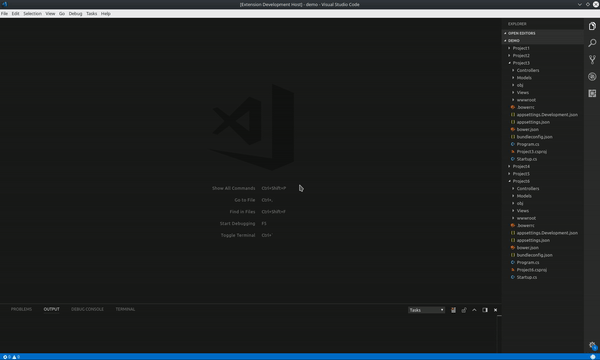

# Open Matching Files


### Extension for Visual Studio Code

Tired of wasting time opening multiple files with the same name across multiple folders??

Introducing Open Matching Files. Open editors for all files matching your search.

## Preview



## Usage

- Use the "Open Matching Files..." command or the `alt+f` keyboard shortcut to bring up the search box and type your search

## Features
- Search for a specific file name that can appear many times across many folders and open them all!
   - `web.config`
   - `app.config`
   - `packages.config`
   - `package.json`
   - `.gitignore`
   - `bower.json`
   - `tsconfig.json`

- Search using glob patterns and open them all! 
  - `**∕*.{ts,js}`
  - `*.{ts,js}`
  - `*.yaml`
  - `stored-procedure-*.sql`
  - `*.csproj`
- Works with any file type or programming language

## Settings

`omf.openFilesConfirmationLimit { number, default=20 }`

- Shows a confirmation before attempting to open more than 20 files. Set to 0 to disable.

```
  "omf.openFilesConfirmationLimit": 50
```

## Integrates with settings.json

Open Matching Files uses the same search api as VSCode's command palette file search. Files and folders excluded here will also be excluded from an Open Matching Files search result.

```
"files.exclude": {
    "**/node_modules": true,
    "**/bin": true,
    "**/obj": true
},
"search.exclude": {
    "**/node_modules": true,
    "**/.vscode-test": true,
    "out": true,
    "**/SomeAnnoyingFileThatAppearsAllOver.txt": true
}
```

## Requirements

- Visual Studio Code version 1.31.0 or later

## Building

```
npm install --no-save
npm run build
```
alternatively...

```
npm install --no-save
npm run watch
```

## Testing

```
npm install --no-save
npm run test
```

## Launching

Click the `Launch Extension` task to run.

## Feedback & Contributing

Please report any bugs, suggestions or documentation requests via [Github issues](https://github.com/bcanzanella/vscode-openmatchingfiles/issues)
